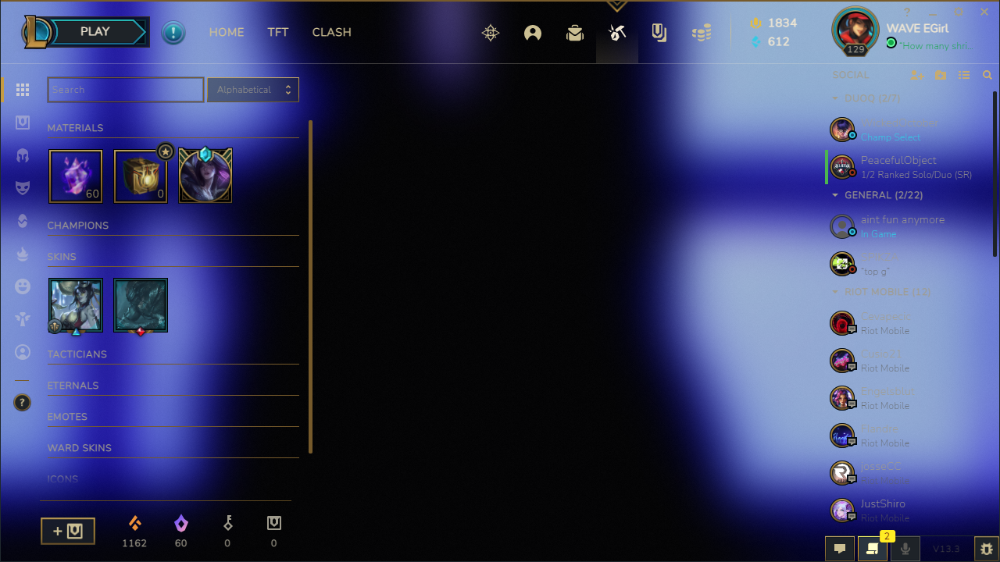
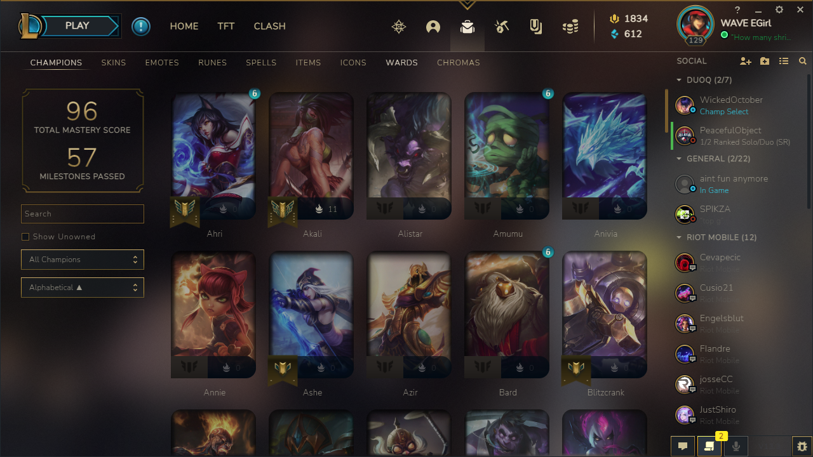

# league-launcher-theme

Works with both 1.0.1 and 0.6.0 of league loader

## How to install?

-  Download https://github.com/nomi-san/league-loader/
-  Create a folder in Plugins with whatever name
-  Put InjectAcrylic.min.js into the folder and rename it to index.js
-  Profit

P.S Rito.

If you want this removed, dont ban me instantly. just message me.

## How to customize Fonts?

-  Open Settings
-  Input a font of choice into the Box
-  Example: `Roboto;300`

Font must be from Google Fonts <3

## Bugs?

If your background is broken, turn on LowSpecMode

## Images

