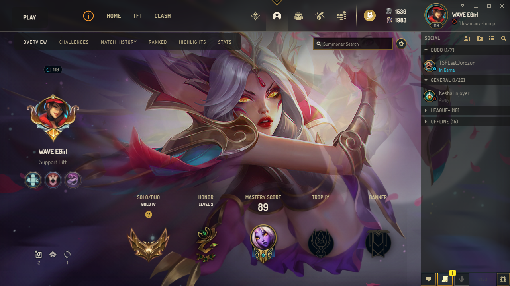
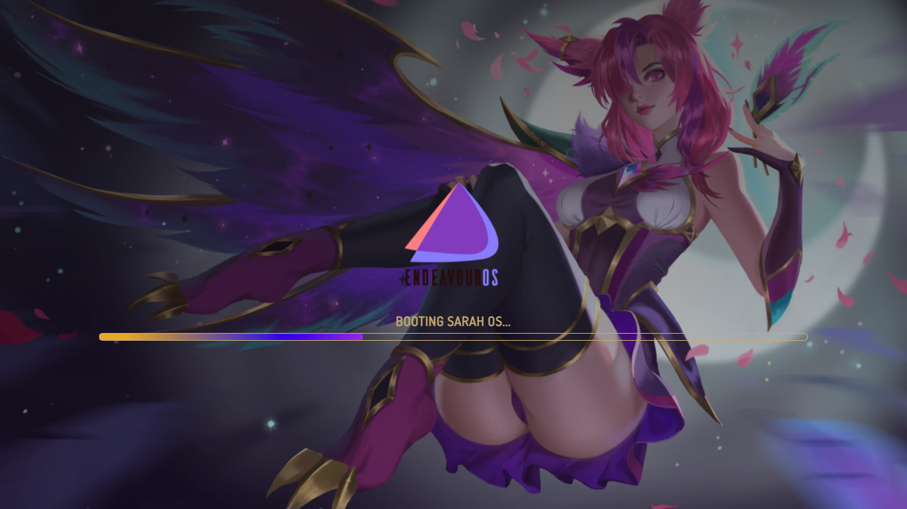
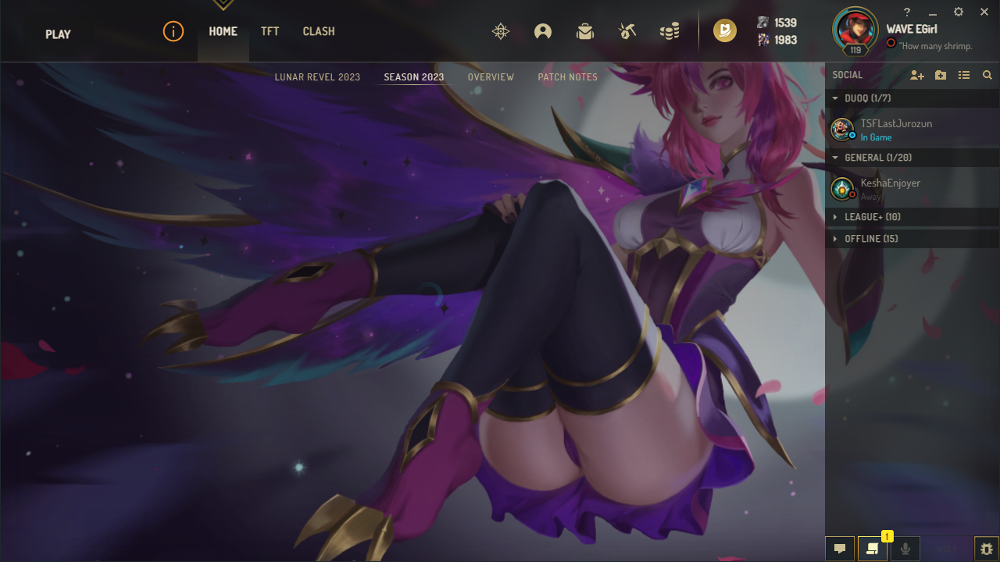

# league-launcher-theme

Should work with 1.0.1 and 0.6.0 of League Loader

## How to install?

-  Download https://github.com/nomi-san/league-loader/
-  Make sure League Loader is 1.0.1
-  Create a folder in Plugins with whatever name
-  Put InjectCute.min.js into the folder and rename it to index.js
-  Profit

## Features

-  It is possible to add an Image URL in the JSON File to have a different background on load

P.S Rito.

If you want this removed, dont ban me instantly. just message me.

## Bugs?

If your background is broken, turn on LowSpecMode

Mirrored into
https://git.thicc-thighs.de/Sarah/league-launcher-theme

## Images

 

