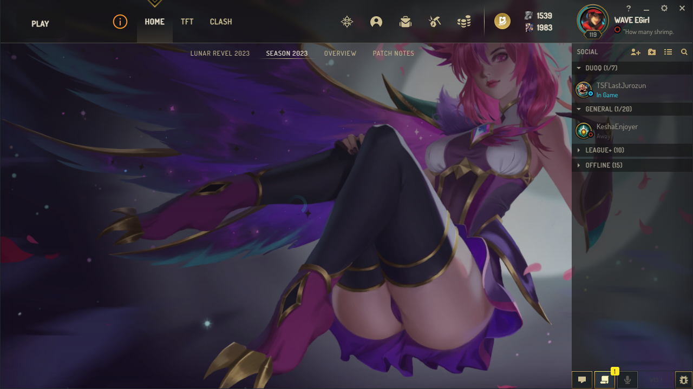
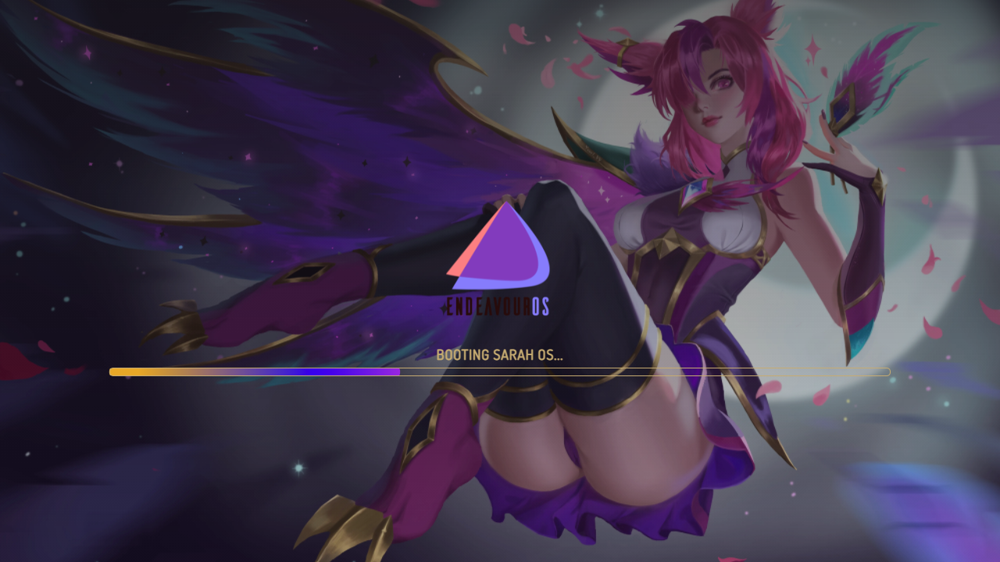
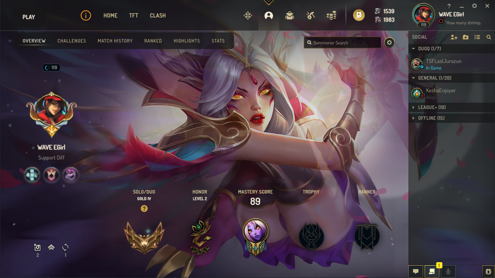

# league-launcher-theme

## How to install?

-  Download https://github.com/nomi-san/league-loader/
-  Put InjectCute.min.js into Plugins Folder
-  Profit

P.S Rito.

If you want this removed, dont ban me instantly. just message me.

## Bugs?

If your background is broken, turn on LowSpecMode

Mirrored into
https://git.thicc-thighs.de/Sarah/league-launcher-theme

## Images

 

